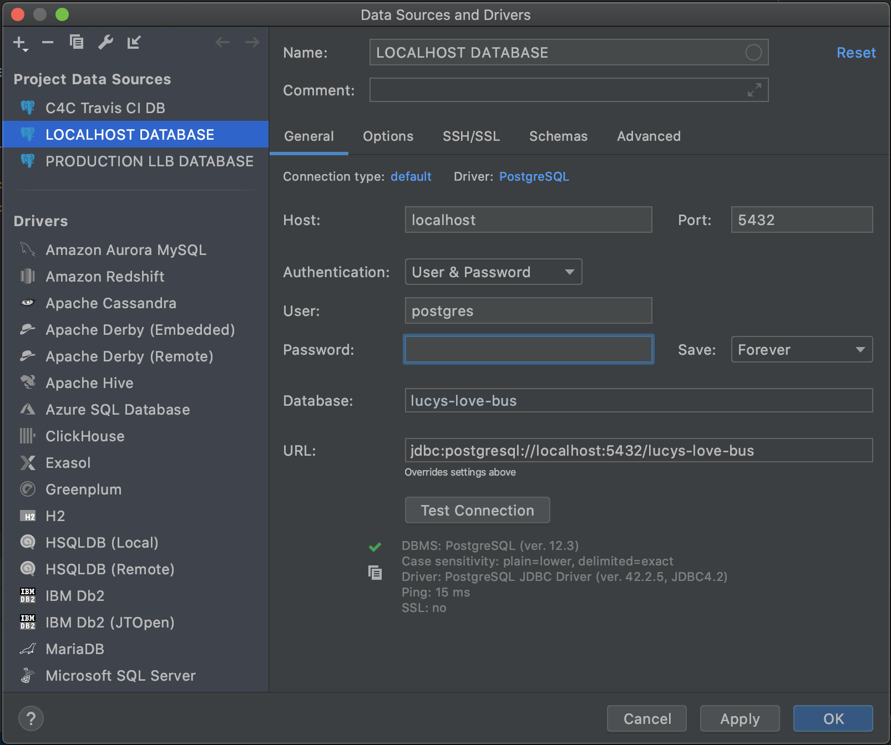

# Setting Up Your Codebase
This is a comprehensive overview of the steps required and everything needed to run the codebase locally. 

## Backend Setup

### Download and Install
1. Download [PostgreSQL](https://www.postgresql.org/download/) (You can use [homebrew](https://dyclassroom.com/howto-mac/how-to-install-postgresql-on-mac-using-homebrew) on MacOS)
2. Download [IntelliJ](https://www.jetbrains.com/idea/download/) (Ultimate available through student account. Ultimate is required to work with JavaScript and TypeScript)
3. Download [Maven](https://maven.apache.org/download.cgi) (this can be done with [homebrew](https://www.youdriveai.com/how-to-install-maven-on-macos-using-homebrew) on MacOS, use this [guide](https://maven.apache.org/install.html) for Windows)
3. [Clone](https://docs.github.com/en/github/creating-cloning-and-archiving-repositories/cloning-a-repository) the relevant GitHub repos.

### Setting JAVA_HOME to JDK 8
1. Download [Java JDK 8](https://www.oracle.com/java/technologies/javase/javase-jdk8-downloads.html)
2. If it does not come with Java JRE 8, download it [here](https://www.oracle.com/java/technologies/javase-jre8-downloads.html)
3. Follow [these steps](https://mkyong.com/java/how-to-set-java_home-on-windows-10/) for Windows
4. Follow [these steps](https://mkyong.com/java/how-to-set-java_home-environment-variable-on-mac-os-x/) for Mac OS
5. Once you have completed the steps, check that it worked by running `java -version` in the command line on Windows and `echo $JAVA_HOME` on Mac OS. This should return something saying the version is 1.8.xxx.

### Start a Local Postgres Database
1. Open the Database tab of IntelliJ (top right). 
2. Click the +, then select PostgreSQL from the Data Source menu.
3. Use these properties: 

3. Open a query console ("QL" button in Database menu)
3. Create a database named exactly `speak-for-the-trees` or `lucys-love-bus` by running `CREATE DATABASE "lucys-love-bus";` 

### Update the Secret Files
1. Open the downloaded repo in IntelliJ
2. Open a terminal (bottom left of IntelliJ)
3. Run `./copy_properties.sh 'common/src/main/resources/properties/'` 
4. In the file `db.properties` make sure the username is `postgres` and the password is the password you set up for the database. If you didn't choose a password leave this field blank.

### Compile the Code Base
1. Run `mvn clean install` from the root directory
2. If the code does not compile after this, remove the target directories from the folders api, common, persist and service, then try again.
3. Run `mvn spotless:apply` to apply code formatting corrections to your code if your build is failing because of `spotless:check`

### Running the API
The ServiceMain.java class has a main method for running the API. Once running, the API is accessible at `http://localhost:8081`. All routes have the `/api/v1` prefix to them. For example, the HTTP request to get all the teams would be `GET http://localhost:8081/api/v1/teams`.

### Backend Overview Video

A while back Liam gave an overview of the backend to a few people. It may be a bit dated now, but it should provide a good introduction to our backend architecture. See the video [here](https://drive.google.com/file/d/1wf8y-5eOwrrj1BUqJ3L1x4lIeDUM11mK/view?usp=sharing).

## Frontend Setup

### Download Node and NPM
Follow the directions at https://nodejs.org/en/ to set up Node.js and NPM on your local computer.

### Configure IntelliJ

Open your project in IntelliJ. If the IDE prompts you to install NPM dependencies, you can just click that. Otherwise, open a terminal and run `npm install`. 
