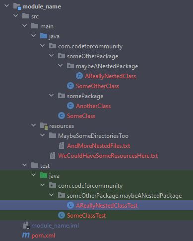
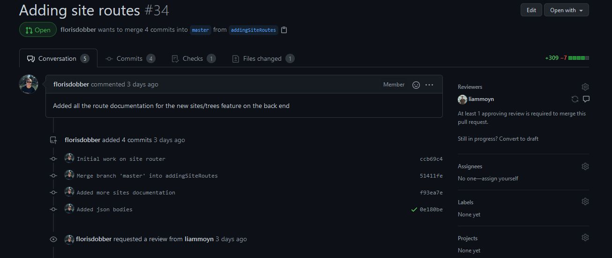
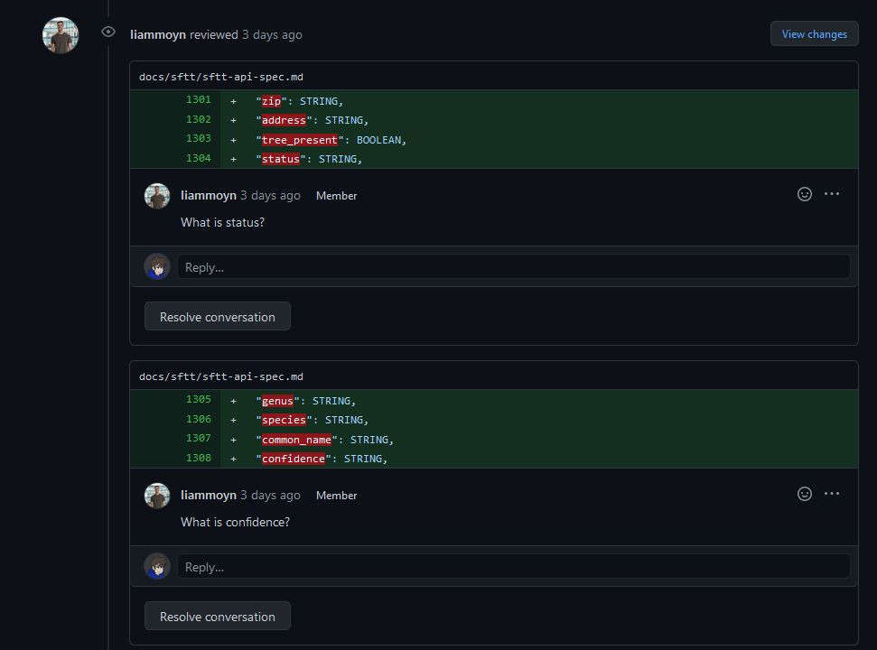
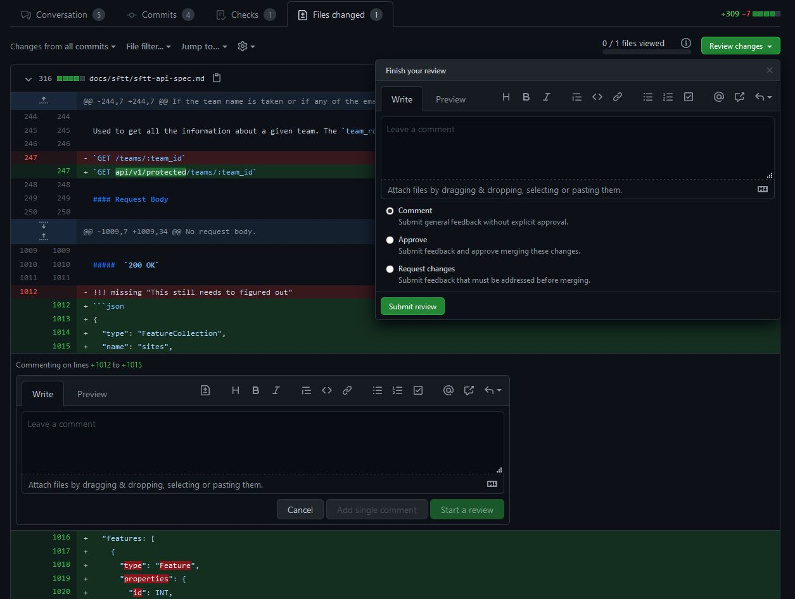
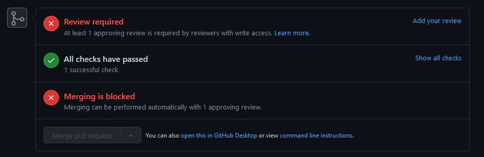
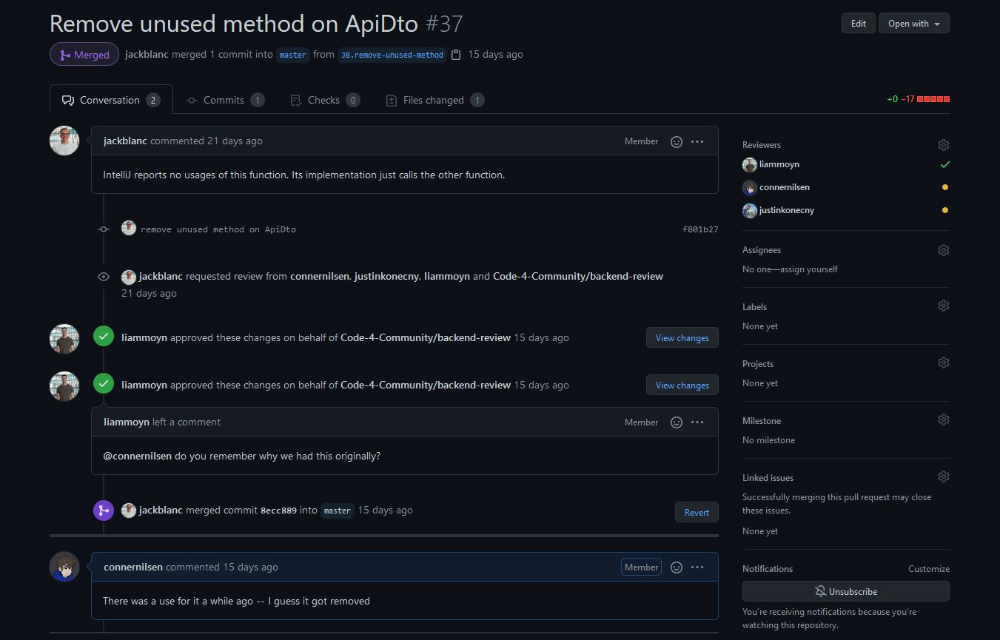

# Working Through a Backend Ticket

!!! info
    This document is still a work in progress.

Hey there! If you're reading this, you're probably pretty new to C4C, or you're refreshing
on how to tickets. In either case, I'm glad you could stop by to read this document. Here,
we're going to go through the basic process of doing work on a ticket. A lot of this will
probably be common sense, but I still want to get it down so that there will be no confusion 
in the future. This document walks through completing a ticket on 
the Backend Scaffold. If you have any questions, _especially_ on this, __please__ reach out
and ask. Good luck on your tickets!

## Agenda

1. Reading Through Your Ticket
2. Planning
    - Project Structure
      - Model, View, Controller (MVC)
    - What will we need to do?
3. Making Changes
    - Modify the API specification
    - Create a new DTO
    - Create a processor interface
    - Create a sub-router and API endpoint
    - Create a new database migration
    - Implement our processor interface
4. Testing!!!
5. Making a Pull Request

## Reading Through Your Ticket

Okay. You've gotten your ticket, but now you need to figure out what to do. While the title
is probably a good indication of the general purpose of the ticket, there are probably 
nuances and fine-print details you won't discover until actually reading through the 
description or implementing it. Therefore, the first step you'll want to take is to 
start reading through your ticket.

Make a note of any questions you may have, and reach
out to your tech/project lead as soon as you can. Since they might have a day off or may 
not get to Slack messages until later, you'll want to get questions out to them
as soon as you can so that they can answer them when they get a chance. Again, the sooner
you can do this, the better, since you don't want to get deep into your project only to find
out you're doing it all wrong. Remember, there are __no stupid questions__. However, if you think you 
have a pretty good idea of the ticket's requirements, don't worry about starting it. 
It's completely alright to start work you don't need answers to any questions, or the 
answers don't block progress (require an answer before you can confidently work).

For the purpose of this document, we'll assume the following is our ticket.

!!! info "Title: Create a Note!"
    __Description:__ Currently, there is no way to add a new note to the database.
    We want to be able to add a note through a REST API and have it be stored in the 
    database. 

    __Points__: 3

??? tip "Definitions"
    Here are a couple of definitions in case you haven't seen them before.
    
    - REST: A set of principles for designing web applications.
    - API: Application Programming Interface. How one application can communicate with 
      another. In the case of Jumpstart, when we mention API, we're referring to 
      the way that our frontend application can make requests to the backend. This is
      managed by the api/ module in the backend repo.
    - Database: A program that enables simpl management of atomic data (numbers, dates, text...).
    - Points: Usually when working using Agile methodologies, tickets, or tasks, are 
      assigned point values representing the amount of work that's expected. 
    - Agile/Scrum: A set of principles for developing software efficiently.


??? question "What are some questions you may have for your project/tech lead?"
    1. What is a note? What fields/properties should a note have? 
        - A note is a data type a user will be relying on to remember information. Notes
          have a date for when they were created, a title, and a body. 
    2. There's no mention of getting the note through an API, is that part of my ticket?
        - Nope, it'll be completed in a separate ticket.
    3.   When you mention date from question 1, does that mean a date or timestamp?
        - Since a timestamp contains information about the day and time, let's use that.
    4. You mention that a note has a timestamp, title, and body, but is it alright to add
       extra fields for other data I might need? Like a user id to match the note to?
        - Sure.

    More questions may come up later, so don't spend too much time trying to get every
    last question answered before starting your ticket. Again, it's alright to start
    work on the ticket as long as there are tasks which don't require answers.

## Planning

??? note "Read this if there are a lot of differences between the backend-scaffold and what we're describing"
    At the time of writing this document, the backend-scaffold's master branch is at 
    `8ecc8893415e145ddfb738151a431e3beb4842e7`. You probably won't have to worry about
    that at all, but if you're seeing major discrepancies between what we're describing
    and what you're seeing, it might make it easier to check out that commit and work
    off of that for a while. If you don't know what that means or how to do it, ask
    your supervisor to help.

To start off, let's take a look at the backend-scaffold. Here's a quick overview of what you're probably seeing.
Open up the Backend-Scaffold project and work through the exercises locally as you read through this document.

### Project Structure

#### Modules

- __api/__ is a directory for defining the API structure that our frontend will interact with.
- __common/__ is a directory containing useful methods and classes for general use cases. This can include things
  like authorization, passwords, logging, and properties files.
- __persist/__ is a directory for defining and handling the data used in our application.
- __service/__ holds the main method for the project,  and it handles
  connecting everything together and basically 'running' your project.

#### Files in the Base Folder

- __.gitattributes__ is a file with git configurations that are project-specific.
- __.gitignore__ is a file containing regular expressions to describe files we don't want Git
  to keep track of when we make commits or push to GitHub.
  >A regular expression (regex) is a syntax used to define text matching the given pattern.
  >Check out [regexr](https://regexr.com/) and [regex101](https://regex101.com/) for some
  >common regexes, descriptions, and a playground to test some out.
- __copy_properties.sh__ contains a shell script for copying properties during a CI/CD build.
- __deploy.py__ is a Python script also assisting with deployment after a CI/CD build.
- __Dockerfile__ is a file that defines how to build an image of this program for containerization through Docker.
- __pom.xml__ is a maven file with project build instructions, dependencies, and other information.
- __README.md__ is a file that introduces the project. It's written in a format called
  [Markdown](https://en.wikipedia.org/wiki/Markdown) (the .md filetype), which allows for
  simple and easy formatting. Usually this file has descriptions of the software, instructions
  for setting it up, and any other information the developer(s) would like to provide to the
  end user.

You might not end up working with a lot of these files, but it's still super useful to know what they do. Now let's take a look at the structure 
of a basic module.



Firstly, notice that modules have their own pom.xml file separate from the one in the base folder. The root pom defines project setup, dependency versions, and
plugins. The module poms only include the dependencies needed for their module. Everything else you will work
with lives inside the main/ and test/ directories in src/. Going even deeper, all the actual java files are in
the com.codeforcommunity package. The resources/ directory (which isn't required), contains static data files that may be used
by the application, like configuration files.

Here's a more in-depth description of what the four modules actually do:

### Model, View, Controller (MVC)

The __api__ module is where all requests will enter through. It is the way that any external clients will interact with
and view the results of our application.

The __common__ module is what handles authentication, properties, session management, emails, and logging. It's kind of
weird that we have an extra module for this, since all of this can probably just go in the service module, but we
pulled it out since this code __rarely__ changes between projects, unlike all other modules. 

The __persist__ module is where all *persisting* information will live. It's the location of our jOOQ database
object relational management classes, so all interactions with the database take place in there.

The __service__ module is what unifies everything together. Since we want to avoid making the persist and api directories
dependent on each other, there will end up being a few interfaces that are made available and implemented in service.

If you've heard about it in Object Oriented Design (OOD) before, this follows the Model, View, Controller (MVC) design
pattern. Persist is our model, api is our view, and service is our controller. For those of you who don't know, 
this basically just separates out functionality into three different main functionalities.

[You can read more about it here.](https://en.wikipedia.org/wiki/Model%E2%80%93view%E2%80%93controller) 

- Model: deals with handling the data and functionality with processing data
- View: deals with presenting data (whether visually, textually, or in any other way) in a way that an external entity
 (like you or another program) can understand what is happening and interact with your program
- Controller: deals with linking up interactions between the model and view, and is the mastermind behind running your
 program and handling external entity interactions (like you clicking a button, or a program sending an HTTP request)

### What will we need to do?

Alright so, we know that we need to add a way to create a note, but what does that actually entail? This ticket comes
down to 2 high level steps: 

1) Creating an API route so someone can request to create a note
2) Storing the note in the database
   
Our database doesn't have a table for notes yet, so that means we'll have to create a database migration 
SQL script so that the database can store our note data. We also don't have any concept of notes in our API, 
so we'll also need to create a new API sub-router. And, since we haven't handled notes in either the API or 
database before, we'll need to create a processor implementation
that can take our note data and store it in the database. Let's list all of our tasks out:

1. Modify the API specification
2. Create a new notes DTO
3. Create a notes processor interface
4. Create a notes sub-router API and note endpoint
5. Create a new database migration
6. Create a new notes processor

That might seem like a lot to do, and it is relatively complex compared to writing a single method which gets a request
and inserts the new note into the database, but this process allows for a much cleaner code structure. This process is also very repeatable, 
so you can use these same methods for future tickets. Additionally, in most cases, you won't
need to create a new sub-router, processor, or database migration, so future tickets could be much simpler. In fact,
if you decide to make a route to get a note's data as a followup ticket, you'll be able to see that for yourself.

Let's see how to actually make these changes.

## Making Changes

Before you start making changes in any repository, you'll want to checkout a new branch for your feature in git. You can
do that by running `git checkout -b <branch_name>`, where branch_name is descriptive of what you're working
on. For example, we'd probably want to run `git checkout -b add-notes` for this branch. Some organizations
also like it when you add your name or initials to the branch name, like `cn.add-notes`, `cn-add-notes`, 
`CN-add-notes`, ..., so you can do that too if you prefer. You should ask your project lead for the team's standard
for branch naming before you start working. 

__If you haven't used git before, be sure you [check out the Jumpstart Git Workshop](https://learn.c4cneu.com/jumpstart/week-1.5-git/) before working on a ticket.__ 

### Modify the API Specification

The very first step you'll want to take before diving into the development work of your ticket is to modify the
API specification of your project. You'll find your project's API specification in the 
[c4c dev docs repo](https://github.com/Code-4-Community/c4c-dev-docs) under the project's directory, but
since the backend-scaffold doesn't have one, we'll just go through the process of doing that here. The general
structure of an API spec looks like this:

```
# Table of Contents

- Individual Notes
    - `POST /api/v1/protected/notes/create`
    - ...
- ...

## Individual Notes

### `POST /api/v1/protected/notes/create`

Creates an individual note in the database. This requires that the user is signed up and logged in.

** Any other useful information about the route can be placed here. **

#### Request Body

 ```
{
    "title": STRING,
    "body": STRING
}
 ```
 
#### Responses

`200 OK`

When the note was successfully created.

 ```
"The note was successfully created"
 ```
 
`400 BAD REQUEST`

If the request body was malformed or either title or body was passed as an empty string

```

The API specification for a single route includes the following sections:

1. The method (POST, GET, ext...) and url of the route you're describing.
2. A short description of what the route is for along with any constraints on the calling / use of the route.
3. A list of all the path and query params used in the route, and a quick sentence describing what they represent.
4. The form of the JSON request body.
5. The possible responses to the request including the status code, a description of when it may be returned, and the form of the JOSN body if applicable.

Generally, when you're updating the API specification, you'll also want to update the table of contents and add
the specification in at the spot where it fits best. Sections that aren't used or aren't applicable can
be removed, so try to thoroughly document the API updates as you see fit. 

If a route has path parameters then they'll show up in the route's url and will be preceded by a colon (`:`). If query parameters
are in the route they'll show up at the end of the url after a `?` and will have a name, a `=`, and then a type, (`keyName=BOOLEAN`)

!!! note "Path parameters"
    The colon in front of a part of the path represents a variable that can be inserted. For example,
    with `GET /api/v1/protected/notes/:note_id`, the `:note_id` param can be 1, 2, ... and so on, and 
    that `:note_id` value can be retrieved later on. It could look something like this:
    `GET /api/v1/protected/notes/1`.

!!! note "Query Parameters"
    A query parameter is information that can be appended to a request. It begins
    with a question mark (?), and multiple values are separated by ampersands (&). The above query param can
    be done like this: `GET /api/v1/protected/notes/:note_id?raw=BOOLEAN`, where `raw=BOOLEAN` says that the raw key can
    be set to either true or false when the request is made.

### Create a new notes DTO

You may have heard or seen the term "DTO" before. A DTO, or Data Transfer Object, is a class whose only
purpose is to hold information, so it can be passed along through different methods. We create DTOs to mirror
the JSON bodies in our API specification, both for request bodies and response bodies.

Let's go through the process of creating a new Notes DTO.

If you look in the `api/` module's `com.codeforcommunity.dto` package, you can see some of the existing DTOs. 
You'll notice a couple of packages that group different DTO types, as well as an `ApiDto` abstract
class, which handles DTO validation for incoming data. The DTO we're about to create, which will deal with
handling incoming note JSON objects, will utilize `ApiDto` for ensuring the incoming data meets the specifications we set in
our persist/ migrations. 

Let's first create a note package to hold all of the DTOs we'll need when handling notes data. In there we'll create a
`CreateNoteRequest` DTO. The following is what the `CreateNoteRequest` DTO will look like.

```java 
public class CreateNoteRequest extends ApiDto {
  private String title;
  private String body;

  /**
   * An empty constructor for CreateNoteRequests. Required by Jackson to decode our JSON into a Java class.
   */ 
  private CreateNoteRequest() { }

  /** A getter for the title. */
  public String getTitle() {
    return this.title;
  }

  /** A getter for the body. */
  public String getBody() {
    return this.body;
  }

  /** A setter for the title. */
  public CreateNoteRequest setTitle(String title) {
    this.title = title;
    return this;
  }

  /** A setter for the body. */
  public CreateNoteRequest setBody(String body) {
    this.body = body;
    return this;
  }

  /**
   * A method for validating whether or not the titles retrieved from the request are valid. This
   * method can perform whatever checks you want it to, but we usually just have it make sure
   * values are non-null. Invalid values are returned in a list.
   */
  @Override
  public List<String> validateFields(String fieldPrefix) throws HandledException {
    String fieldName = fieldPrefix + "create_note_request.";
    List<String> invalidFields = new ArrayList<>();

    if (this.title == null || this.title.length() == 0) {
      invalidFields.add(fieldName + "title");
    }
    if (this.body == null || this.body.length() == 0) {
      invalidFields.add(fieldName + "body");
    }

    return invalidFields;
  }
}
```

The DTO is basically just getters and setters, as well as a `validateFields(String)` method, which
you can use to define what constitutes a valid field. If a particular field is not valid, you can add that field name
to a list which gets returned from the method, indicating the fields that have an invalid value.

TODO: Move the following two to where we talk about the migration script

If you saw in the list of questions we had for the tech lead earlier, you've probably noticed that there are a few
fields missing
from the DTO that we'll need for the database. Two of them, the `id` and `date` fields, will be handled for us
by the database. The `SERIAL` value we added to modify the `id` field tells the database that it can
automatically set the value using an auto increment, so each insert will have the `id` of the previous entry
+ 1. Similarly, we manually set a `DEFAULT` on the `date` field to automatically enter the current timestamp
as a value for that field (unless explicitly specified, but we won't be doing that).

The other field, `user_id`, can be retrieved from methods provided later on,
so it's not something that has to be included as part of the request. You also wouldn't want to include that
as part of the request because then people would be able to set notes as other people! Make sure you pay attention
to where you get user information from, and ensure you're not introducing possible bugs or security issues
into the application.

We're all done with the DTO now, so let's take a look at the processor interface, which will tell the api/ module
what it can do with notes.

### Create a notes processor interface

Now we need to create a "processor" for notes. In C4C, we use the term processor to define
a class that deals with interactions between our routing (that's typically handled by Vertx) and our database (that's typically handled by jOOQ).

We first want to create a Java interface for our notes processor in the 'api' package of the api/ module.
We can call this interface `INotesProcessor` and it will have a single method for each API route we define
that relates to notes. Each method should receive all the information the user sends in the HTTP request and
it should return the data the user gets back if the request is successful.

Our route doesn't return a JSON body in the API specification, so our interface method will have a void return type.
We've already defined our input DTO class, so we know we need so add that as an input parameter to our method as well.

TODO: Add something talking about userId / JWTData

TODO: Move the following paragraph somewhere else

Each module in a project is compiled separately of each other. Because of this, if you want to include a
module's classes in another module, you have to include it as a dependency on that project. If you take a look at the
pom.xml file in service/, you'll notice that the api/, persist/, and common/ modules are all included
in the dependencies list. Let's make an interface in api/ that will provide a method signature to the
routers we've been working with created.

```java
public interface INotesProcessor {
  /**
   * Creates a new note in the database for the given user.
   */
  void createNote(CreateNoteRequest req, String userId);
}
```

We'll have to actually implement this interface later, but we'll set up our routing before we deal with that.

### Create a notes sub-router API and note endpoint

Now that we have an idea of what we'll be able to do, we need to create a way for the backend to receive the information
provided with the request, add it to the `CreateNoteRequest` DTO, and pass that data into the `createNote` method of our interface
from the previous section. If you want to read more about HTTP requests and routing, you can check that out 
[here](https://learn.c4cneu.com/guides/postrequest/).

We handle our routing using the [Vert.x Web](https://vertx.io/docs/vertx-web/java/#_using_vert_x_web) library.
VertX lets us define routes, routers, and subrouters to match the URL of the route we're trying to implement.
The route we're trying to implement is `POST /api/v1/protected/notes/create`.

The ApiRouter class in the `com.codeforcommunity.rest` package has an `initializeRouter(Vertx vertx)` method
where we can define all route URLs. The `/api/v1` prefix is common to all C4C API routes, and any routes we
add in the `initalizeRouter` method, is assumed to start with that in their URL. The next part of our route that we
need is `/protected`, this is a special keyword in our URL that tells the backend that this route can only be
called by users that are fully signed in. ApiRouter also handles this for us and lets us define all protected
routes in the `defineProtectedRoutes(Vertx vertx)` method.

At this point we still need to add routers for the `/notes/create` part of our URL. Because this is the first route
we're making that relates to notes, we'll create a subrouter class that can handle all routes that start with `/apiv1/protected/notes`.
This way when we implement other notes API routes like `GET /api/v1/protected/notes` or `POST /api/v1/protected/notes/1/deadline`
we will only have to edit our subrouter class instead of having to also change ApiRouter as well.

Let's first create the subrouter, and then modify ApiRouter to register it.

#### The Sub-Router

Here's the code for a sub-router for handling notes. You'll want to create this in the api/ module, under the 
`com.codeforcommunity.rest.subrouter` package. Remember that every route we register here we are assuming has
a URL that starts with `/api/v1/protected/notes`.

```java
public class NotesRouter implements IRouter {
  // An instance of the processor interface we made
  private final INotesProcessor processor;
  
  public NotesRouter(INotesProcessor processor) {
    this.processor = processor;
  }

  @Override
  public Router initializeRouter(Vertx vertx) {
    Router router = Router.router(vertx);
    
    registerCreateNote(router);
    
    return router;
  }

  /**
   * A Method that sets up the "create note route" and sets the handleCreateNote method as its handler
   */
  private void registerCreateNote(Router router) { 
    Route createNoteRequest = router.post("/create");
    createNoteRequest.handler(this::handleCreateNote);
  }

  /**
   * A method that gets called when the "create note route" is called
   */
  private void handleCreateNote(RoutingContext ctx) {
    JWTData userData = ctx.get("jwt_data");
    CreateNoteRequest noteRequest = RestFunctions.getJsonBodyAsClass(ctx, CreateNoteRequest.class);
  
    processor.createNote(noteRequest, userData.getUserId());
  
    end(ctx.response(), 200, "Note successfully created");
  }
}
```

On the first line, you can see that this class implements `IRouter`. This interface provides a single method for
initializing the router with a `Vertx` instance, and you can see that that `initializeRouter` method is overridden 
below. We'll come back to that in a second to discuss exactly what it's doing. Next up, we have an
instance of the `INotesProcessor` declared as a `private final` field, which is provided through the constructor.

```java 
@Override
public Router initializeRouter(Vertx vertx) {
  Router router = Router.router(vertx);
  
  registerCreateNote(router);
  
  return router;
}
```

In the `initializeRouter` method replicated above, we take in a `Vertx` instance. Using that `Vertx` 
instance, we get a new `Router` from `Router.router(vertx)`, and call the `registerCreateNote` method below. Finally,
we return the set up router.

```java 
// A Method that sets up the "create note route" and sets the handleCreateNote method as its handler
private void registerCreateNote(Router router) {
  Route createNoteRequest = router.post("/create");
  createNoteRequest.handler(this::handleCreateNote);
}
```

This `registerCreateNote` method, starts by taking in a `Router` instance. With that `Router` instance it does two things. 
First, it creates an individual POST `Route` for the `/create` endpoint by calling `router.post("/create")`.
Then, it sets a handler method that should be called for the returned `Route`. If we wanted to use a different 
HTTP operation instead of POST, we could call `router.get(<route>)` or `router.<method>(<route>)` instead. 
The `handler()`method called on the `Route` takes in a 
[method reference](https://docs.oracle.com/javase/tutorial/java/javaOO/methodreferences.html), which is just a
way of referencing a method defined in this class. 
Method references tell the createNoteRequest route, and therefore the router it was created from, which method to call when the 
route is called. In this case, we're having using the `handleCreateNote` method. Let's wrap up the sub-router
code by taking a look at that.

```java 
// A method that gets called when the "create note route" is called
private void handleCreateNote(RoutingContext ctx) {
  JWTData userData = ctx.get("jwt_data");
  CreateNoteRequest noteRequest = RestFunctions.getJsonBodyAsClass(ctx, CreateNoteRequest.class);

  processor.createNote(noteRequest, userData.getUserId());

  end(ctx.response(), 200, "Note successfully created");
}
```

Route handlers methods take in
a `RoutingContext`, defined by the Vert.x library, and don't return anything. The `RoutingContext` object gives
acess to request properties (like the body, path parameters, query parameters, ...), and allows you to respond to the request
when you're done. We can also add our own data to the request like the `JWTData` object that is added to every
route that has the `/protected` keyword in its URL. The `JWTData` object contains secure information about the user, 
like their id, which we'll need for completing this ticket. 

After we get the `JWTData`, we use a custom method in the
`RestFunctions` class to load the request body into the `CreateNoteRequest` DTO we created earlier. The 
`getJsonBodyAsClass` method turns JSON into a class, and calls the `validateFields()` method we defined
earlier. If any of the fields are not filled in correctly the API will return an error to the user, so we now
know that our noteRequest object is fully filled in.

We now have all the information we need to call the method we defined earlier in `INotesProcessor`, so we 
can call `processor.createNote(noteRequest, userData.getUserId())`. Once that method returns our processing
is complete, and we can end the request by calling the `end()` method (defined in the `ApiRouter` class), which will
return a response to the user who called the API. In our case, we want to give the 200 status code and return
a static string as the response JSON body, so we simply pass 200 and the response string as our second and third
arguments to `end()`.

!!! note
    `RestFunctions.getJsonBodyAsClass` only takes in DTOs that extend the `ApiDto` abstract class. This is 
    so that it can call `validateFields` and make sure incoming JSON data is what we expect.

That wraps up all of the work we need to do to set up the sub-router, so let's take a look at how this is set up
in the `ApiRouter` class.

#### The ApiRouter

Let's now register our new `NotesRouter` sub-router with the `ApiRouter` class in the `com.codeforcommunity.rest` package,
so that the new route can be called.
To do that, we'll need to add a new `private final NotesRouter notesRouter` field, adjust the constructor, and
adjust the `defineProtectedRoutes` method. By the way, this class is already available in api/ under the
`com.codeforcommunity.rest` package.

```java
public class ApiRouter implements IRouter {
  private final CommonRouter commonRouter;
  private final AuthRouter authRouter;
  private final ProtectedUserRouter protectedUserRouter;
  private final NotesRouter notesRouter; // Added our subrouter as a field
  
  public ApiRouter(
      IAuthProcessor authProcessor,
      IProtectedUserProcessor protectedUserProcessor,
      JWTAuthorizer jwtAuthorizer,
      INotesProcessor notesProcessor) { // Taking in an implementation of our interface
    this.commonRouter = new CommonRouter(jwtAuthorizer);
    this.authRouter = new AuthRotuer(authProcessor);
    this.protectedUserRouter = new ProtectedUserRouter(protectedUserProcessor);
    this.notesRouter = new NotesRouter(notesProcessor); // Creating our subrouter by passing along the processor
  }
  
  /** Initialize a router and register all route handlers on it. */
  public Router initializeRouter(Vertx vertx) {
    Router router = commonRouter.initializeRouter(vertx);

    router.mountSubRouter("/user", authRouter.initializeRouter(vertx));
    router.mountSubRouter("/protected", defineProtectedRoutes(vertx));

    return router;
  }
  
  private Router defineProtectedRoutes(Vertx vertx) {
    Router router = Router.router(vertx);
    
    router.mountSubRouter("/user", protectedUserRouter.initializeRouter(vertx));
    router.mountSubRouter("/notes", notesRouter.initializeRouter(vertx)); // Defining our subrouter under the '/notes' url

    return router;
  }

  ...
}
```

!!! info
    The lines we actually added stuff on are 5, 11, 15, and 24.

The main `ApiRouter` is mounted at `/api/v1/`, so all routers registered under it have their
routes appended after the `/api/v1/` part. We then call `router.mountSubRouter()` to chain these routers along, mounting
them at certain paths on the parent router. For the authRouter, that happens at `/api/v1/user`. For the protectedUserRouter
that happens at `/api/v1/protected/user`. For the new `notesRouter`, that happens at `/api/v1/protected/notes/`.

Note how in the first line of `intializeRouter` we're starting with the commonRouter instead of calling `Router.router(vertx)`
like in our other router methods. `CommonRouter` is where the `JWTData` object is added to routes with the `/protected` keyword
in them as well as any other operation that needs to happen for many routes.

### The Database Migration

Next up, we'll be writing the database migration. If you remember from before, the persist directory is where the 
model part and database interactivity parts of our application are located.
When you open the directory, you'll notice that there is no java/ directory located within src/main/. That's because
we actually don't manually create any classes here. An external ORM dependency, [jOOQ](https://www.jooq.org/), manages
that for us. Therefore, all of our files will be in
the resources/ directory that was mentioned earlier. There's a config set somewhere that tells Flyway, another
dependency for performing migrations, to look for the migration files in the db.migration directory. Flyway will
run migrations that haven't been performed in the order of their version numbers
the next time the project is built, and jOOQ will generate ORM classes for each table.

!!! danger
Remember that __you can never edit a migration once it's been committed to master__, or else environments
that have already run that migration will either notice something has changed and *delete all information in
the database* (which is really dangerous), or *avoid running the change you made, which can put the database in
a bad state and cause future migrations to behave incorrectly or fail*. Also, __do not add a migration with a
version number that is less than or equal to any already existing migration versions__. This will also end up
deleting any database information, which is *very bad*.

??? tip "Definitions"
- Migration: A SQL script defining modifications to a database. They're often done in separate steps as migrations
rather than as one single large SQL script because you can avoid deleting information
in the database, especially in a production environment. Therefore, each of these migrations describe the
changes to get the database's structure updated from the previous migration.
- Object Relational Mapper (ORM): A library that generates a method of working with
incompatible type systems (Java objects and SQL database tables in our case) natively from one syntax. In
our case, it allows us to write SQL queries using Java classes and interact with classes as if
they were an object.

Let's take a look at the already existing tables in the database. If you've run `mvn` or `mvn install` before,
and the build succeeded, you should be able to see the following tables in whichever data viewer you're using.

- `blacklisted_refreshes`: Contains a list of invalid verification key hashes so that the keys can be invalidated
  when a user logs out.
- `flyway_schema_history`: The current migration status for Flyway, so that it knows which migrations should be applied
  on a build. This table isn't created in a migration file, it's created automatically for us by Flyway.
- `users`: a table containing user information.
- `verification_keys`: Session information for a user.

!!! info
You can feel free to use whichever data viewer you would like. We recommend against using the PostgreSQL
console directly (unless you need to for certain tasks), and instead think you should focus on using PGAdmin,
the Database Viewer in IntelliJ, or the JetBrains DataGrip.

We're going to want another table, `notes`, to store notes for a use. If you know SQL, try creating one on your
own in a `V2__Notes_Table.sql` file in the same directory that `V1__Initial_Import.sql` exists in
(*there are __two__ underscores between V2 and Notes*). We'll have an answer in the dropdown below.

??? question "Can you write a migration for the notes table?"
``` postgresql
CREATE TABLE IF NOT EXISTS notes (
id          SERIAL          PRIMARY KEY,
created     TIMESTAMP       NOT NULL    DEFAULT CURRENT_TIMESTAMP,
title       VARCHAR(255)    NOT NULL,
body        TEXT            NOT NULL,
user_id     INTEGER         NOT NULL,
CONSTRAINT notes_user_id_fk FOREIGN KEY (user_id)
REFERENCES users (id)
);
```
Now that we have the migration created you may be wondering two very important questions:

1. How do we run this migration in the database?
2. How do we get jOOQ to create our ORM classes?

Fortunately, the answer to both questions is easy. All you have to do is run Maven! With migrations, you'll
want to run `mvn clean install` (a shorthand for this command is just `mvn`!), since sometimes issues can pop
up when jOOQ is constructing your ORM classes. Try it out, and then you'll be able to see that a `NotesRecord`
class was generated in the persist/target/generated-sources/jooq/... directory of the persist module.

??? error "If you get an error mentioning `@Generated`, read this!"
If you're getting the `@Generated` error, that means the wrong version of Java was used with Maven.
To fix this, you'll want to make sure you're running Maven with the IntelliJ Maven tool. You should be
able to locate it at the top of the right toolbar.

    If you're still getting issues, go to File > Project Structure > Project, and make sure your language
    level is 8. You may also need to set the Project SDK to Java 8 too. If that doesn't solve it,
    reach out to your team lead for help.

Cool, now we're done with working in persist/. Let's finish up the implementation details by creating the `INotesProcessor` 
interface.

### Create a new notes processor

Remember from earlier when we created the interface for the `INotesProcessor`? It should look something like this:

```java 
public interface INotesProcessor {
  /**
   * Creates a new note in the database for the given user.
   */
  public void createNote(CreateNoteRequest req, String userId);
}
```

Let's create an implementation for it now.

#### Create the Implementation

We're going to go through and implement it now. Go to the service/ package, under the `com.codeforcommunity.processor`
package, and create a new `NotesProcessorImpl` class. It should start out looking like this:

```java 
public class NotesProcessorImpl implements INotesProcessor {
  private final DSLContext db;

  public NotesProcessorImpl(DSLContext db) {
    this.db = db;
  }

  @Override
  public void createNote(CreateNoteRequest req, int userId) {
    NotesRecord notesRecord = db.newRecord(Tables.NOTES);
    notesRecord.setUserId(userId);
    notesRecord.setTitle(req.getTitle());
    notesRecord.setBody(req.getBody());
    notesRecord.store();
  }
}
```

In the constructor, and as a field, you can see we're getting and storing a `DSLContext` object. The `DSLContext` class
is what jOOQ (remember, our ORM from the previous section), uses as an entry point for interacting with the database.
With it, we can compose queries to do almost anything. In this case, though, we'll be using it to create a new
`NotesRecord`. 

In the `createNote()` method we override, we first call `db.newRecord(Tables.NOTES)` to create a new record
for the `NOTES` table, which produces a new `NotesRecord` object. We can now proceed to fill in the required o
information, adding the information passed in with the `CreateNoteRequest` and `userId` by calling the setter methods
on `NotesRecord`. Once all of the required information has been added, we can call `notesRecord.store()` to 
automatically compose a SQL query to add this record to the database. No SQL necessary! 


Now that we have our `NotesProcessorImpl`, what do we do next? Well, we'll add the note to the database.
Earlier, you saw the `NotesTable` class that was generated for us by jOOQ. We'll use the `db` field to
get a new instance of `NotesRecord`, set the values, and then call `NotesRecord.store()` to save it to the
database. No need to write any SQL!

Let's wire this into the `ApiRouter`.

#### Provide the NotesProcessorImpl to ApiRouter

Finally, we need to instantiate this in `ServiceMain` so that it can get a `DSLContext` and begin processing
requests. We'll also need to provide it to our `ApiRouter`, so that it can properly set up the `NotesRouter` too. 
In the `ServiceMain.initializeServer()` method, we'll create a new `NotesProcessorImpl` and pass
it in to the `ApiRouter`'s constructor.

```java 
  /** Initialize the server and get all the supporting classes going. */
  private void initializeServer() {
    ...

    // Create the processor implementation instances
    IAuthProcessor authProc = new AuthProcessorImpl(this.db, emailer, jwtCreator);
    IProtectedUserProcessor protectedUserProc = new ProtectedUserProcessorImpl(this.db, emailer);
    INotesProcessor notesProcessor = new NotesProcessorImpl(this.db);

    // Create the API router and start the HTTP server
    ApiRouter router = new ApiRouter(authProc, protectedUserProc, notesProcessor, jwtAuthorizer);
    startApiServer(router, vertx);
  }
```

Awesome! You're done creating and dealing with your processor. Let's test everything to make sure it works now.

## Testing!!!

Testing is an extremely important part of the development process, as it ensures that the changes we are pushing
don't introduce new bugs into the product. There are really only two modules that you really need to work on
testing when working on a ticket: the service/ module and the common/ module. 

The api/ module doesn't need to
be tested because a lot of the logic should be extremely simple and handled almost entirely by Vertx, so 
testing whether or not routes are registered or calling the methods you expect will be immediately apparent 
when doing manual testing. In fact, the way we tested if the note was successfully added to the database
in the previous section is a perfect example of how to test manually. 

The persist/ module also doesn't need to be tested, since the only changes you should have to make there are
to create database migrations. You'll be testing that module when you build your project and see the new migrations
reflected in the database.

The `createNote()` method we created in the processor is a method that we should go through and test. Let's 
create a new class in the test directory within service/. Your test directory should, in a way, mirror the main
directory containing all of your code. By that, I mean if the class you want to test appears in a specific package,
you'll want to place your test class in a matching package and name it the name of the class + "Test". For
the `NotesProcessorImpl` class, we'll create a `NotesProcessorImplTest` class in the `com.codeforcommunity.processor` 
package.

Here's how your `NotesProcessorImplTest` should start:

```java 
public class NotesProcessorImplTest {
  private NotesProcessorImpl processor;
  private JooqMock db;

  @BeforeEach
  public void setup() {
    this.db = new JooqMock();
    this.processor = new NotesProcessorImpl(db.getContext());
  }
}
```

Once you have your `NotesProcessorImplTest` class set up, you're going to start by creating a field for storing
an instance of a `NotesProcessorImpl`. We'll have that automatically be set up for us by creating a method
with the `@BeforeEach` annotation; one that is used by JUnit so that it can be called before each test to
set up whatever information you need for your tests. We're using that setup annotation here because every test in this
class will be testing the `NotesProcessorImpl`. Therefore, it's useful to have it be set up prior to a test instead
of copying code all over the place to set it up the same way every time.

Since we were using an external dependency, jOOQ in that method, we need a way to mock its behavior since we don't
actually want to insert data into the database in a test like this. To do that, we created a `JooqMock` class
to handle testing methods which have jOOQ interactions in them. You'll also want to add that as a field to your
class, since it has a `DSLContext` that will be passed into the `NotesProcessorImpl`.

Now, let's go ahead and create our first test. Down below, add the following code:

```java 
@Test
public void createNoteTest() {
  db.addEmptyReturn(OperationType.INSERT);
  int expectedId = db.getId();

  String title = "Some Title";
  String body = "Some Body";
  int userId = 12345;
  CreateNoteRequest req = new CreateNoteRequest();
  req.setTitle(title);
  req.setBody(body);

  processor.createNote(req, userId);

  // Test that INSERT was only called once
  assertEquals(1, db.timesCalled(OperationType.INSERT));
}
```

We can now start setting up the `JooqMock` for our test. Since we're only calling 
`NotesRecord.store()`, we're not expecting a record to be returned (this isn't a `SELECT` operation). 
Therefore, you can set up the `JooqMock` by telling it to expect to return nothing, which is done
by calling the `JooqMock.addEmptyReturn()` method. Since we're expecting an `INSERT` operation to occur,
we can pass in "INSERT" as the parameter for the operation. The `JooqMock` also has the ability to assign
a new id to the record when it's inserted, so we'll want to get that value and validate it later on. 
Use the `JooqMock.getId()` method to get the value that will be used next.

Next, you can create a `CreateNoteRequest` and set it up with whatever values you're expecting. 
Call `NotesProcessor.createNote()` with the `CreateNoteRequest` and a value you choose for a `userId`.

Let's start validating properties about the record that was created. There are two methods that you'll
focus on for this: `JooqMock.timesCalled()` and `JooqMock.getSqlOperationBindings()`. 

`timesCalled()` takes in an `OperationType` 
for the SQL operation you're expecting, and returns an int representing the number of times that
operation was called. In this case we're expecting it to be 1. 

Now we want to test some things about the information that would have been inserted into the database
with `JooqMock.getSqlOperationBindings()`.

```java 
@Test
public void createNoteTest() {
  ...
  
  // Get the list of object arrays. Each item in the list represents a DB call, and each item in the array represents
  // a single parameter of the DB call.
  List<Object[]> inserts = db.getSqlOperationBindings().get(OperationTypes.INSERT);
  
  // Test that the length of the insert invocations is the same as the number of times called
  assertEquals(1, inserts.size());
  // Test that the number of values inserted in the first invocation is the length we're expecting
  Object[] firstInsert = inserts.get(0);
  assertEquals(4, firstInsert.length);
  
  // Test each of the values in the first invocation
  assertEquals(expectedId, firstInsert[0]);
  assertEquals(title, firstInsert[1]);
  assertEquals(body, firstInsert[2]);
  assertEquals(userId, firstInsert[3]);
}
```

`getSqlOperationBindings()` is a little bit more involved. The `JooqMock` records values that are inserted during
an operation, and saves them in a nested array of objects. Let's dissect it right now, since it may be
confusing to see at first. `getSqlBindings()` returns a `Map<String, List<Object[]>>`, and at the surface
level, it maps operations to a list of invocations. An individual invocation is the `Object[]` containing
the values inserted into the database, so the list of invocations comes into play when you call an operation
multiple times. Therefore, each value in the `List<Object[]>` represents the set of values the operation was
called with each time it was called.

The first thing we want to do with `getSqlBindings()` is verify that the length of the list for 
`INSERT` operations is the same as the value for `timesCalled()`. We'll also want to verify that the length
of the underlying array is what we're expecting; that is, we want to verify that each of the values we added
to the `NotesRecord` was included, +1 for the `id` that jOOQ automatically adds for us. We do that with the following
part:

```java 
// Test that the length of the insert invocations is the same as the number of times called
assertEquals(1, inserts.size());
// Test that the number of values inserted in the first invocation is the length we're expecting
Object[] firstInsert = inserts.get(0);
assertEquals(4, firstInsert.length);
```

Finally, we'll go through and check each of the values that were added there to make sure they're what we're
expecting. For this, you may need to run your debugger and see what order they were added in, and then 
use the ordering you find in your tests.

```java 
// Test each of the values in the first invocation
assertEquals(expectedId, firstInsert[0]);
assertEquals(title, firstInsert[1]);
assertEquals(body, firstInsert[2]);
assertEquals(userId, firstInsert[3]);
```

If we had more than one database operation occur during the test, we would also go through and test the following
positions in the list of invocations in a similar manner. The test class should look like this in the end:

```java
public class NotesProcessorImplTest {
  private NotesProcessorImpl processor;
  private JooqMock db;

  @BeforeEach
  public void setup() {
    this.db = new JooqMock();
    this.processor = new NotesProcessorImpl(db.getContext());
  }
  
  @Test
  public void createNoteTest() {
    db.addEmptyReturn(OperationType.INSERT);
    int expectedId = db.getId();
  
    String title = "Some Title";
    String body = "Some Body";
    int userId = 12345;
    CreateNoteRequest req = new CreateNoteRequest();
    req.setTitle(title);
    req.setBody(body);
  
    // Call the processor method
    processor.createNote(req, userId);
  
    // Test that INSERT was only called once
    assertEquals(1, db.timesCalled(OperationType.INSERT));
    
    // Get the list of object arrays. Each item in the list represents a DB call, and each item in the array represents
    // a single parameter of the DB call.
    List<Object[]> inserts = db.getSqlOperationBindings().get(OperationTypes.INSERT);
    
    // Test that the length of the insert invocations is the same as the number of times called
    assertEquals(1, inserts.size());
    // Test that the number of values inserted in the first invocation is the length we're expecting
    Object[] firstInsert = inserts.get(0);
    assertEquals(4, firstInsert.length);
    
    // Test each of the values in the first invocation
    assertEquals(expectedId, firstInsert[0]);
    assertEquals(title, firstInsert[1]);
    assertEquals(body, firstInsert[2]);
    assertEquals(userId, firstInsert[3]);
  }
}
```

If there were edge cases present or features of the method that weren't tested by the test we just created,
then we'd go ahead and validate those too. Since that successfully tests the entire method though, we're
done with testing!

Now we'll finish up our ticket by making sure everything is pushed to GitHub and starting a pull request.

## Making the Pull Request

Alright, so you've read through your ticket, worked on the implementation, tested your code, and you're ready
to merge it in. So now what? At C4C (and probably all of your co-ops), merging your work right when you're done
usually isn't the best practice. Usually you'll want someone to look over your work and make sure 
your code works as expected for two main reasons: you'll want to make sure you're not introducing unintended
side effects through typos and bugs you may have missed, and you'll also want to make sure it actually fulfills
the requirements of the ticket. It's also a really good time to let someone else see if there are improvements
that can be made to your implementation. 

The way that these reviews are usually done is through a pull request (PR) on GitHub (or almost any git hosting 
alternative). The pull request tool is a convenient way to have a discussion about your work, request someone
to review it, perform reviews, and run checks on your code to make sure it can successfully build.

You can open up a pr by viewing your branch in GitHub and clicking on the "Pull request" button
on the upper right (it should appear right above the total number of commits). Once you do that,
you'll have the chance to see the changes made in your code and add information about what changes you're
making in the title or comment. After that, you can open the request by clicking on the green "Create pull 
request" button. 

You from now on, you can access your pull request by visiting the repository and clicking on the "Pull Requests" tab
at the top. The pr page should look a bit like this.



There, people can come and leave comments on your code.



On the "Files changed" tab, you can see all of the changes made on your branch. People can also leave
reviews, summarizing their opinions on the changes you've made. If they think the changes you made
are good, then they can also approve. Otherwise, if there are changes to be made, they can submit reviews
as either regular comments or requests for changes.



At this stage of the development cycle, you'll probably go through a couple of rounds of changes followed 
by reviews. You can just keep committing to your branch and pushing to GitHub normally, and your changes
will show up for your reviewer(s) to see. Whenever you want (another) review, make sure you Slack them to make sure
they're aware that you have something ready to be reviewed. 

At the bottom of the main review page, you can see the status of your PR. You can see below that you are blocked
from merging your request until two things happen: you get an approving review and all checks have passed.
Before merging your request, make sure all comments have been addressed (either through discussions or 
implementations). Once you're ready to merge things in, and you have gotten both a review and passing checks,
the "Merge pull request" button at the bottom of the status section will light up green. Click it, and your changes
will be merged into master. 



And that's it, you're done with your ticket! Be sure to click the button to delete your branch, and you'll be
set. 



If you have any improvements to make to this tutorial, please be sure to edit the doc (and make a PR for it)! Thanks
for reading.
